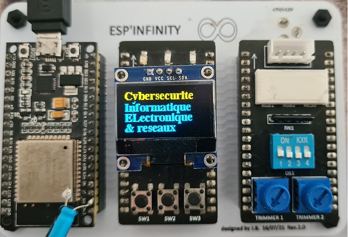
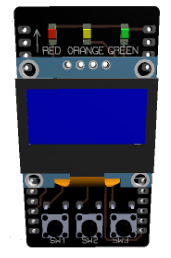
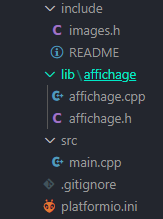
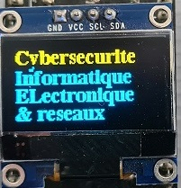
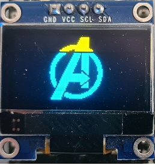

![ESP32 PlatformIO](https://img.shields.io/badge/ESP32-PlatformIO-orange?logo=data%3Aimage%2Fsvg%2Bxml%3Bbase64%2CPHN2ZyB3aWR0aD0iMjUwMCIgaGVpZ2h0PSIyNTAwIiB2aWV3Qm94PSIwIDAgMjU2IDI1NiIgeG1sbnM9Imh0dHA6Ly93d3cudzMub3JnLzIwMDAvc3ZnIiBwcmVzZXJ2ZUFzcGVjdFJhdGlvPSJ4TWlkWU1pZCI+PHBhdGggZD0iTTEyOCAwQzkzLjgxIDAgNjEuNjY2IDEzLjMxNCAzNy40OSAzNy40OSAxMy4zMTQgNjEuNjY2IDAgOTMuODEgMCAxMjhjMCAzNC4xOSAxMy4zMTQgNjYuMzM0IDM3LjQ5IDkwLjUxQzYxLjY2NiAyNDIuNjg2IDkzLjgxIDI1NiAxMjggMjU2YzM0LjE5IDAgNjYuMzM0LTEzLjMxNCA5MC41MS0zNy40OUMyNDIuNjg2IDE5NC4zMzQgMjU2IDE2Mi4xOSAyNTYgMTI4YzAtMzQuMTktMTMuMzE0LTY2LjMzNC0zNy40OS05MC41MUMxOTQuMzM0IDEzLjMxNCAxNjIuMTkgMCAxMjggMCIgZmlsbD0iI0ZGN0YwMCIvPjxwYXRoIGQ9Ik0yNDkuMzg2IDEyOGMwIDY3LjA0LTU0LjM0NyAxMjEuMzg2LTEyMS4zODYgMTIxLjM4NkM2MC45NiAyNDkuMzg2IDYuNjEzIDE5NS4wNCA2LjYxMyAxMjggNi42MTMgNjAuOTYgNjAuOTYgNi42MTQgMTI4IDYuNjE0YzY3LjA0IDAgMTIxLjM4NiA1NC4zNDYgMTIxLjM4NiAxMjEuMzg2IiBmaWxsPSIjRkZGIi8+PHBhdGggZD0iTTE2MC44NjkgNzQuMDYybDUuMTQ1LTE4LjUzN2M1LjI2NC0uNDcgOS4zOTItNC44ODYgOS4zOTItMTAuMjczIDAtNS43LTQuNjItMTAuMzItMTAuMzItMTAuMzJzLTEwLjMyIDQuNjItMTAuMzIgMTAuMzJjMCAzLjc1NSAyLjAxMyA3LjAzIDUuMDEgOC44MzdsLTUuMDUgMTguMTk1Yy0xNC40MzctMy42Ny0yNi42MjUtMy4zOS0yNi42MjUtMy4zOWwtMi4yNTggMS4wMXYxNDAuODcybDIuMjU4Ljc1M2MxMy42MTQgMCA3My4xNzctNDEuMTMzIDczLjMyMy04NS4yNyAwLTMxLjYyNC0yMS4wMjMtNDUuODI1LTQwLjU1NS01Mi4xOTd6TTE0Ni41MyAxNjQuOGMtMTEuNjE3LTE4LjU1Ny02LjcwNi02MS43NTEgMjMuNjQzLTY3LjkyNSA4LjMyLTEuMzMzIDE4LjUwOSA0LjEzNCAyMS41MSAxNi4yNzkgNy41ODIgMjUuNzY2LTM3LjAxNSA2MS44NDUtNDUuMTUzIDUxLjY0NnptMTguMjE2LTM5Ljc1MmE5LjM5OSA5LjM5OSAwIDAgMC05LjM5OSA5LjM5OSA5LjM5OSA5LjM5OSAwIDAgMCA5LjQgOS4zOTkgOS4zOTkgOS4zOTkgMCAwIDAgOS4zOTgtOS40IDkuMzk5IDkuMzk5IDAgMCAwLTkuMzk5LTkuMzk4em0yLjgxIDguNjcyYTIuMzc0IDIuMzc0IDAgMSAxIDAtNC43NDkgMi4zNzQgMi4zNzQgMCAwIDEgMCA0Ljc0OXoiIGZpbGw9IiNFNTcyMDAiLz48cGF0aCBkPSJNMTAxLjM3MSA3Mi43MDlsLTUuMDIzLTE4LjkwMWMyLjg3NC0xLjgzMiA0Ljc4Ni01LjA0IDQuNzg2LTguNzAxIDAtNS43LTQuNjItMTAuMzItMTAuMzItMTAuMzItNS42OTkgMC0xMC4zMTkgNC42Mi0xMC4zMTkgMTAuMzIgMCA1LjY4MiA0LjU5MiAxMC4yODkgMTAuMjY3IDEwLjMxN0w5NS44IDc0LjM3OGMtMTkuNjA5IDYuNTEtNDAuODg1IDIwLjc0Mi00MC44ODUgNTEuODguNDM2IDQ1LjAxIDU5LjU3MiA4NS4yNjcgNzMuMTg2IDg1LjI2N1Y2OC44OTJzLTEyLjI1Mi0uMDYyLTI2LjcyOSAzLjgxN3ptMTAuMzk1IDkyLjA5Yy04LjEzOCAxMC4yLTUyLjczNS0yNS44OC00NS4xNTQtNTEuNjQ1IDMuMDAyLTEyLjE0NSAxMy4xOS0xNy42MTIgMjEuNTExLTE2LjI4IDMwLjM1IDYuMTc1IDM1LjI2IDQ5LjM2OSAyMy42NDMgNjcuOTI2em0tMTguODItMzkuNDZhOS4zOTkgOS4zOTkgMCAwIDAtOS4zOTkgOS4zOTggOS4zOTkgOS4zOTkgMCAwIDAgOS40IDkuNCA5LjM5OSA5LjM5OSAwIDAgMCA5LjM5OC05LjQgOS4zOTkgOS4zOTkgMCAwIDAtOS4zOTktOS4zOTl6bS0yLjgxIDguNjcxYTIuMzc0IDIuMzc0IDAgMSAxIDAtNC43NDggMi4zNzQgMi4zNzQgMCAwIDEgMCA0Ljc0OHoiIGZpbGw9IiNGRjdGMDAiLz48L3N2Zz4=)

# Afficher du texte ou une image sur un afficheur Oled 0.96" I2C

## Objectifs

> Lors de développement de système électroniques, il est utile voire essentiel d'afficher sur un écran Oled les données de fonctionnement d'un projet.

## 1 -  Nomenclature

- La carte ESP'Infinty équipée de son [ESP32-wroom-32](https://www.az-delivery.de/en/products/esp32-developmentboard) permet une connectivité simplifiée entre le µC et l'afficheur.



- Le module O-leds-BP



## 2 - Déploiement logiciel

Les librairies utilisées sont celles proposées par Adafruit disponibles dans PlatformIO sous VScode.

```cpp
#include <Adafruit_I2CDevice.h>
#include <Adafruit_GFX.h>
#include <Adafruit_SSD1306.h>
#include "Fonts/FreeSerifBold9pt7b.h"   // Police de caractères
```

### Déclaration

```cpp
//Instanciation de l'objet oled dans la classe Adafruit_SSD1306
Adafruit_SSD1306 oled(OLED_WIDTH, OLED_HEIGHT, &Wire, OLED_RESET);
```

### Configuration

Cette étape permet l'initialisation de l'écran par son adresse, tout en fixant son orientation *oled.begin()*. Les méthodes *.setTexteSize()*, *.setFont()* et *.setTextColor()* configurent respectivement la taille, la police et la couleur du texte à afficher.

```cpp
 oled.begin(SSD1306_SWITCHCAPVCC, OLED_ADRESS); // démarrage du Oled en fixant son orientation et son adresse
 oled.setTextSize(TAILLE_TEXTE);
 oled.setFont(&FreeSerifBold9pt7b); // police de caractère *optionnelle
 oled.setTextColor(SSD1306_WHITE);
 oled.clearDisplay();
```

## 3 - Création d'une bibliotèque

 > Afin de faciliter l'utilisation de l'afficheur Oled, on utilisera un bibliotèque déposée dans le dossier *lib* du projet. Dans VScode, ilfaut créer un dossier nommé identiquement à la bibliothèque créée.

<br>



</br>

Voici le fichier de déclaration *affichage.h*

```cpp
/* Programme de gestion de l'afficheur
 * Oled 0.96" I2C 128x64
 */
#ifndef AFFICHAGE_H
#define AFFICHAGE_H

#include <Arduino.h>
// Liaison I2C et afficheur Oled

#define SDA_PIN 21
#define SCL_PIN 22
#define OLED_RESET 4 // Reset pin # (or -1 if sharing Arduino reset pin)
#define OLED_ADRESS 0x3C
#define OLED_WIDTH 128
#define OLED_HEIGHT 64
#define OFFSET_PIXEL 1
#define GAUCHE 0
#define CENTRE 1
#define DROITE 2

#define FONTS ArialMT_Plain_16      // Police de caractères par défaut
#define FREEBOLD FreeSerifBold9pt7b // Police de caractères par défaut
#define TAILLE_TEXTE 1
#define LIGNE_1 0
#define LIGNE_2 1
#define LIGNE_3 2
#define LIGNE_4 3
#define ORIGINE_X 0
#define ORIGINE_Y 0

void initAfficheur(void);
void effacerAfficheur(void);
void afficher(int ligne, String texte, uint8_t alignement = GAUCHE);
bool actualiserAffichage(bool etatAcomparer);
void afficherImage(const uint8_t *bitmap);

#endif // AFFICHAGE_H
```

Voici le fichier de définition *affichage.cpp*

```cpp
#include <Arduino.h>
#include "affichage.h"
#include <Adafruit_I2CDevice.h>
#include <Adafruit_GFX.h>
#include <Adafruit_SSD1306.h>
#include "Fonts/FreeSerifBold9pt7b.h"

Adafruit_SSD1306 oled(OLED_WIDTH, OLED_HEIGHT, &Wire, OLED_RESET);

void initAfficheur(void)
{
    oled.begin(SSD1306_SWITCHCAPVCC, OLED_ADRESS);
    oled.setTextSize(TAILLE_TEXTE);
    oled.setFont(&FREEBOLD);
    oled.setTextColor(SSD1306_WHITE);
    oled.clearDisplay();
}

void effacerAfficheur(void)
{
    oled.clearDisplay();
}

void afficher(int ligne, String texte, uint8_t alignement)
{
    switch (alignement)
    {
    case GAUCHE:
        alignement = GAUCHE;
        break;
    case CENTRE:
        alignement = OLED_WIDTH / 2 - texte.length() * 3.9;
        break;
    case DROITE:
        alignement = OLED_WIDTH - texte.length() * 3.9;
        break;

    default:
        break;
    }
    switch (ligne)
    {
    case LIGNE_1:
        oled.setCursor(alignement, OLED_HEIGHT * 1 / 4 - OFFSET_PIXEL);
        break;
    case LIGNE_2:
        oled.setCursor(alignement, OLED_HEIGHT * 1 / 2 - OFFSET_PIXEL);
        break;
    case LIGNE_3:
        oled.setCursor(alignement, OLED_HEIGHT * 3 / 4 - OFFSET_PIXEL);
        break;
    case LIGNE_4:
        oled.setCursor(alignement, OLED_HEIGHT - OFFSET_PIXEL);
        break;
    }
    oled.print(texte);
    oled.display();
}

bool actualiserAffichage(bool etatAcomparer)
{
    bool etat = false;
    return etat;
}

void afficherImage(const uint8_t *bitmap)
{
    oled.drawBitmap(ORIGINE_X, ORIGINE_Y, bitmap, OLED_WIDTH, OLED_HEIGHT, 1);
    oled.display();
}
```

## 4 - Affichage d'un texte

Il faut initialiser l'afficheur puis l'effacer.

```cpp
void setup()
{
  initAfficheur();
  effacerAfficheur();
}
```

### Programme principal

On appele la fonction *afficher(numero ligne,"message")* pour afficher le texte voulu.

```cpp
void loop(void)
{ 
  afficher(LIGNE_1, "Cybersecurite");
  afficher(LIGNE_2, "Informatique");
  afficher(LIGNE_3, "ELectronique");
  afficher(LIGNE_4, "& reseaux");
}
```



## 4 - Affichage d'une image

On ajoute la bibiothèque *images.h* où sont sauvegardées les images.

```cpp
#include "images.h"
```

### Programme principal

On appele la fonction *afficherImage(const uint8_t *bitmap)* en renseignant le nom de l'image.

```cpp
void loop(void)
{
  afficherImage(avengers);
}
```



---

&copy; 2025 BTS CIEL-ER Lasalle Avignon - J.BEAUMONT
